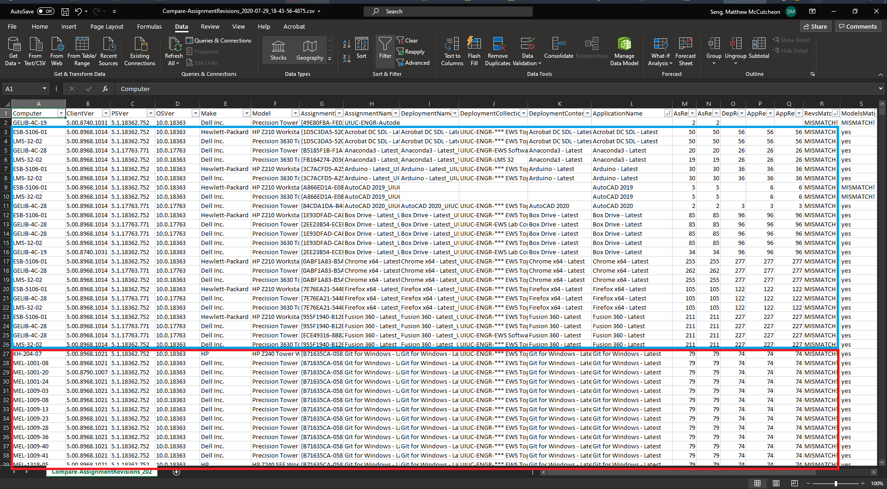

# Summary

This is a Powershell script (in module form) to poll a list of computers for their SCCM assignments, and compare the relevant app revisions stored in the assignment to the current app revision of the associated application and deployment/task sequence in SCCM.  
The purpose is to identify issues where the revision stored in a client's local assignment list doesn't match the actual/latest revision of the associated application or app/TS deployment. When this happens, chaos ensues.  

The module takes an array of strings representing computer names, or a string representing an SCCM collection name (and polls SCCM for a list of computer names in that collection). The module outputs a CSV of all assignments discovered on those computers. Additionally, it logs the whole process to a log file. See the [Parameters](#parameters) section for details on the output files.  

Much of this script is based on knowledge about problems and bugs with SCCM documented in a couple TechNet articles. From what I can tell, both of these issues (and more) are eventual results of this same underlying failure.
- Apps don't all show up in Software Center: https://social.technet.microsoft.com/Forums/en-US/e0bd29ad-adf5-4c33-a2f2-740df8cc6c32/applications-not-visible-in-software-center?forum=configmanagerapps
- Deployment reporting is all f'd up: https://social.technet.microsoft.com/Forums/en-US/8f54f591-073a-49b5-b433-cd6a0947a13a/all-deployments-reporting-ci-version-info-timed-out?forum=configmanagerapps

# Table of contents
- [Usage](#usage)
- [Interpretation](#interpretation)
- [Remediation](#remediation)
- [Parameters](#parameters)
- [Technical details](#technical-details)
- [Notes](#notes)

# Usage

### Prerequisites
- Must be run on a machine with the SCCM Console app installed.
    - May need to customize `-CMPSModulePath` depending on version of Console. See [Parameters](#parameters).
- WinRM (PSRemoting) must be properly configured on all machines to be polled.
- Powershell must be run as a user with local admin permissions on the machines to be polled.
- Powershell must be run as a user with read permissions to all relevant content in SCCM.

If any of the last three prerequisites aren't met, the script will fail to poll various data for the relevant machine, and will move on to the next.  

### Instructions
1. Download `Compare-AssignmentRevisions.psm1` to `$HOME\Documents\WindowsPowerShell\Modules\Compare-AssignmentRevisions\Compare-AssignmentRevisions.psm1`
2. Run it, e.g.:
    - `Compare-AssignmentRevisions -SiteCode "MP0" -Provider "sccmcas.company.com" -Collection "Collection Name"`
    - `Compare-AssignmentRevisions -SiteCode "MP0" -Provider "sccmcas.company.com" -Computers "computer-name-01"`
    - `Compare-AssignmentRevisions -SiteCode "MP0" -Provider "sccmcas.company.com" -Computers "computer-name-01","computer-name-02","computer-name-03"`

`-SiteCode` and `-Provider` values must be customized for your environment. If you're not sure, ask your SCCM admin.  
You can customize the default `-SiteCode` and `-Provider` near the top of the script, so they don't have to be given every time. See [Parameters](#parameters).  
If you change the script after importing the module, you must reimport the module using the `-Force` parameter: `Import-Module ".\CompareAssignmentRevisions.psm1" -Force`.  

# Interpretation
The primary way to identify problems is to look at the `RevsMatch` column of the output CSV file.  
If you see any entries with `MISMATCH!` in the `RevsMatch` field, then you know something is wrong.  

The other thing to watch out for is missing values. Values which are expected to be missing are given filler values in the output CSV, so empty cells also mean something is wrong.  
When viewing the CSV in Excel, it's advisable to select all blank cells and fill them with whitespace.  
This prevents neighboring cells from visually overflowing, which makes it difficult to notice blank cells. See this [tutorial](https://www.skyneel.com/fill-blank-cells-with-0-or-any-specific-value-in-excel).  

I recommend sorting by `RevsMatch` and then by various other fields, to see which apps, deployments, collections, or machines the problem revolves around.  
To identify problematic app deployments, try sorting by `RevsMatch`, then by `ApplicationName`, then by `DeploymentCollection`.  
To identify problematic machines, try sorting by `RevsMatch`, then by `Computer`.  
Also keep an eye on the `ClientVer`, `PSVer`, and `OSVer` columns, as you may notice a correlation between problems and software versions.  

In this example, I've sorted by `RevsMatch` and then by `ApplicationName`.  
There are dozens of unique apps which all have 2-4 `MISMATCH!` entries (in blue). This implies that there's something wrong on the 4 or so machines which account for almost all of these mismatches, but probably nothing wrong with the apps/deployments themselves.  
Then there's one app (`Git for Windows - Latest`) which has ~300 `MISMATCH!` entries (in red). This implies that there's something wrong with the deployment(s) of `Git for Windows - Latest`, and probably nothing wrong with the individual machines themselves.  

For more in-depth troubleshooting, see the [Technical details](#technical-details) section below to get a feel for what all the values actually mean.  

Note: Don't open the CSV file in Excel until the script is done, because Excel will lock the file and prevent the script from writing to it.  
In this case, the script will simply fail to write (attempted after processing each computer) and will continue on.  
If you want to check on progress using Excel before the script is done, make a copy of the CSV and open that instead.  

# Remediation
This script performs no actual actions on computers.  
It's sole purpose is to gather data for use in diagnosing where problems exist, and so inform your decisions on what remediation actions to take.  

I'm not an expert on this (somehow), but it seems that there are various actions that can be taken to fix revision issues.  
I don't necessarily prescribe any particular procedure, but one or more of the following actions have been reported to work in various cases.  
In order of SCCM hierarchy:  
- Edit an app's deployment type and redistribute the app
- Delete and re-create a deployment
- Reinstall the client on an affected machine
- Push policy to an affected machine
- Run scripts (suggested in the technet threads linked above) to force evaluation of assignments on an affected machine
    - These remediation scripts/commands could potentially be mass-deployed via SCCM

In ideal cases, one of the first two actions may solve the problem across all affected machines, unless they also have further local issues (such as an unhealthy client).

# Parameters

### -Computers
Required string array, if not using `-Collection`. Takes an array of strings representing computer names.  

### -Collection
Required string, if not using `-Computers`. Takes a string representing a collection name.  

### -NoLog
Optional switch. If present, a log file is not made.  
Progress will still be output to the screen and the CSV file will still be made.  

### -LogPath
Optional string, representing the full path to a text file.  
Default value is `c:\engrit\logs\Compare-AssignmentRevisions_yyyy-MM-dd_HH-mm-ss.log`, because that's where the author likes to keep logs.  
Path to CSV output file will use the same name, except with a `.csv` extension.  
You can change the default value near the top of the script.  

### -DisableCaching
Optional switch. Disables caching of data retrieved from SCCM.  

By default (i.e. when `-DisableCaching` is _not_ specified), the first time the script has to pull data from SCCM it caches that data.  
Applies to applications, application deployments, TS deployments, TSes, and collections.  
Any time an assignment refers to a cached item, the item's info is pulled from the cache, instead of directly from SCCM.  
Caching _significantly_ reduces runtime and traffic back and forth to SCCM.  
This is especially relevant when scanning a large swath of machines that all share many deployments (the expected normal use case).  
For comparison, a scan of 1200+ machines that took ~24 hours without caching, took only ~12 hours with caching enabled.  

The side effect of caching is that any changes made to relevant SCCM objects while the script is running won't be reflected in the script's logic and output.  
However this is probably irrelevant in almost all scenarios.  
If data changes in SCCM while the script is running that would make the output very confusing and much less valuable.  
Optional non-caching behavior was left in mostly because this was originally the default behavior of the script before caching was added.  

### -ComputerInfoOnly
Skips gathering information about local applications/assignments, deployments, collections, and applications.  
Returns only one line for each machine with the machine-level information (`Computer`, `ClientVer`, `PSVer`, `OSVer`, `Make`, and `Model`).  
This was just an afterthought. Useful just to gather some quick info from the environment.  

### -SiteCode
Optional string, representing the Site Code ID for your SCCM site.  
Default value is `MP0`, because that's the author's site.  
You can change the default value near the top of the script.  

### -Provider
Optional string, representing the hostname of your provider.  
Use whatever you use in the console GUI application.  
Default value is `sccmcas.ad.uillinois.edu`, because that's the author's provider.  
You can change the default value near the top of the script.  

### -CMPSModulePath
Optional string, representing the local path where the ConfigurationManager Powershell module exists.  
Default value is `$($ENV:SMS_ADMIN_UI_PATH)\..\ConfigurationManager.psd1`, because there's where it is for us.  
You may need to change this, depending on your SCCM (Console) version. The path has changed across various versions of SCCM, but the environment variable used by default should account for those changes in most cases.  
You can change the default value near the top of the script.  

### -Verbosity
Optional integer. Bigger means more verbose output of progress. Only useful for debugging problems with the script.  
Using a value greater than `0` will result in a very large log file when scanning many machines.  
- `0`: Default value. Outputs minimal information once per computer.  
- `1`: Outputs minimal information once per assignment.  
- `2`: Outputs most steps taken for every assignment, several of the values gathered, and outputs when each step is done.  
- `3`: Misc. debug/test output.

### -CIMTimeoutSec
Optional integer. Specifies the number of seconds to wait when polling a machine for data via CIM before timing out and moving on.  
Default value is `10`.  
Machines are always pinged first to ensure connectivity. This value relates to CIM calls made to machines where the ping was successful.  
Common reasons an online machine might not respond to a CIM call are:  
- The user running Powershell doesn't have appropriate permissions
- WinRM and/or the firewall are not configured properly on the machine
- WMI is messed up on the machine

If the script is hanging while gathering data from machines, try using the `-DisableCIMFallbacks` switch (see below).  

### -DisableCIMFallbacks
Optional switch. If specified, fallback methods for failed `Get-CIMInstance` queries are skipped.  
By default when a `Get-CIMInstance` query to a machine returns no results (i.e. errors out), various fallback queries are used, depending on the specific query.  
These fallback queries are usually WMI queries, or `Invoke-Command` calls.  

Using fallbacks will improve reliability of data gathering in mixed environments with various Powershell and OS versions.  
However note that WMI queries used as fallbacks can sometimes hang due to problems on the remote computer being queried.  
This can cause the script to stall indefinitely, because there is no built-in method for timing out hung WIM queries.  
Unfortunately, unlike `Get-CIMInstance` (which has a built-in `-OperationTimeoutSec` parameter), it's not trivial to timeout a `Get-WMIObject` query.  
Update: The script now uses background jobs to run Invoke-Command and Get-WMIObject calls, which allows for timeouts to avoid these hangs. See new timeout and fallback parameters below.  

### -DisableCIM
Optional switch. Not recommended.  
If specified, the script skips attempting to query computers using `Get-CIMInstance` and skips directly to the next fallback (which is `Invoke-Command`).  

### -DisableIC
Optional switch.  
If specified, the script skips attempting to query computers using `Invoke-Command` (if it falls back this far), and skips directly to the next fallback (which is `Get-WMIObject`).  

### -DisableWMI
Optional switch.  
If specified, the script skips attempting to query computers using `Get-WMIObject` (if it falls back this far).  
Note: it is possible to disable all three query methods, but this would be pointless.  

### -ICTimeoutSec
Optional integer.  
Specifies the number of seconds to wait when polling a machine for data via `Invoke-Command` before timing out and moving on.  
Default value is `10`.  

### -WMITimeoutSec
Optional integer.  
Specifies the number of seconds to wait when polling a machine for data via `Get-WMIObject` before timing out and moving on.  
Default value is `10`.  

# Technical details
Below are detailed notes about how the script works and how the various types and sources of data it uses are structured and gathered.  

Note: I'll use the following terminology below:  
- "Direct apps": apps which are assigned to a machine because they are directly deployed to a collection containing that machine.
- "TS apps": apps which are assigned to a machine because they are part of a task sequence (TS) which is deployed to a collection containing that machine, but which are not (necessarily) deployed themselves.

Direct app assignments are treated differently than TS app assignments. As such, some values differ slightly between these cases (which made this script and the necessary research much more complicated). These differences are noted below.  

### Procedure
To summarize the procedure of the script:  
- Build list of computer names
- For each computer:
    - Pull SCCM client version, Powershell version, OS version, and Make/Model
    - Pull locally stored applications (not doing anything with these yet, as they don't seem to contain any relevant information)
    - Pull locally stored assignments
    - For each assignment:
        - Pull associated deployment
        - Pull associated app
        - Compare revisions of assignment, deployment, and app
        - Append list of assignments (with all relevant data) to CSV
- Output list of assignments to screen (if it's not insanely long)

### Output fields
Fields output to the CSV are documented below. The source for each field is noted. The sources are documented below. The final table output to the screen contains fewer fields (so it fits on the screen), omitting the less important ones.
- `Computer`: Given. Computer name.
- `ClientVer`: Source #1. SCCM client version.
- `PSVer`: Source #2. Powershell verison.
- `OSVer`: Source #3. OS version.
- `Make`: Source #4. Manufacturer of system/mobo.
- `Model`: Source #4. Make of system/mobo.
- `AssignmentID`: Source #5. Unique ID of assignment. Matches 1:1 with a deployment.
- `AssignmentName`: Source #6. String representing an assignment's name. See formatting notes below.
- `DeploymentName`: Source #7. String representing a deployment's name. See formatting notes below.
- `DeploymentContent`: Source #7 (direct apps) or #6 (TS apps). String representing the app's name (direct apps) or the TS name (TS apps).
- `DeploymentCollection`: Source #7 (direct apps) or #6 (TS apps). String representing the collection to which the app or TS is deployed.
- `ApplicationName`: Source #10. The friendly name of the app.
- `AsConfigType`: Source #6. The "DesiredConfigType" as stored by the assignment (i.e. whether the associated deployment is meant to be an `Install`, or an `Uninstall`). This is stored in two locations. If for some reason they don't match this will be `INVALID!`.
- `AsConfigType`: Source #7. The "DesiredConfigType" as stored by the deployment object (i.e. whether the deployment is meant to be an `Install`, or an `Uninstall`). This is stored in two locations. If for some reason they don't match this will be `INVALID!`.
- `ConfigTypesMatch`: Calculated. If the 2 ConfigType values (above) match, the value is `yes`. If they don't, the value is `MISMATCH!`.
- `AsRev1`: Source #6. The revision of the app, as stored by the assignment.
- `AsRev2`: Source #6. The revision is stored in the assignment in two places, so I'm capturing both. However I've never seen an instance where these two differ within the same assignment.
- `DepRev`: Source #7. The revision of the app, as stored by the deployment object.
- `AppRev1`: Source #10. The revision of the app, as stored by the applicaiton object.
- `AppRev2`: Source #10. The revision is stored in the application object in two places, so I'm capturing both. However I've never seen an instance where these two differ within the same application object.
- `RevsMatch`: Calculated. If all 5 revisions (above) match, the value is `yes`. If they don't, the value is `MISMATCH!`. This field is the raison d'etre for this script.
- `ModelsMatch`: Calculated. If all 5 ModelNames (below) match, the value is `yes`. If they don't, the value is `MISMATCH!`.
- `AsModel1`: Source #6. The `ModelName` of the app, as stored by the assignment.
- `AsModel2`: Source #6. The `ModelName` is stored in the assignment in two places, so I'm capturing both. However I've never seen an instance where these two differ within the same assignment.
- `DepModel`: Source #7. The `ModelName` of the app, as stored by the deployment object.
- `AppModel1`: Source #10. The `ModelName` of the app, as stored by the applicaiton object.
- `AppModel2`: Source #10. The `ModelName` is stored in the application object in two places, so I'm capturing both. However I've never seen an instance where these two differ within the same application object.

### Data sources
It's useful to note which data comes from which sources. All information comes from one of the sources explained below.  
I use the term "local machine" to emphasize that this data is coming directly from computers out in the wild, though they are more accurately described as "remote machines", with respect to the computer running the script.  
Sources #1-#5 generally attempt a `Get-CIMInstance` query first, and fall back on `Get-WMIObject` or `Invoke-Command`.  

- Local machine sources:
    - `Source #1`: CIM/WMI query to the local machine for the SCCM client version info.
        - `Get-CIMInstance -ComputerName $compName -Namespace "root\ccm" -Class "SMS_Client"`
    - `Source #2`: CIM/WMI query to the local machine for the Powershell version info.
        - `Invoke-Command -ComputerName $compName -Scriptblock { $PSVersionTable.PSVersion }`
        - or WMI query for registry value of `SOFTWARE\Microsoft\PowerShell\3\PowerShellEngine\PowerShellVersion`
		- Note: There is no Get-CIMInstance implementation for this source (couldn't find one that worked), so specifying `-DisableCIMFallbacks` will result in this value being empty.
    - `Source #3`: CIM/WMI query to the local machine for the OS version info.
        - `Get-CIMInstance -ComputerName $compName -Class "Win32_OperatingSystem"`
        - or `Invoke-Command -ComputerName $compName -ErrorAction Stop -Scriptblock { [Environment]::OSVersion.Version }`
    - `Source #4`: CIM/WMI query to the local machine for the Make/Model info.
        - `Get-CIMInstance -ComputerName $compName -Class "Win32_ComputerSystem"`
        - or `Invoke-Command -ComputerName $compName -ErrorAction Stop -ScriptBlock { Get-WMIObject -Class "Win32_ComputerSystem" -ErrorAction Stop }`
    - `Source #5`: CIM/WMI query to the local machine for its stored application info.
        - `Get-CIMInstance -ComputerName $compName -Namespace "root\ccm\clientsdk" -Query "select * from CCM_Application"`
    - `Source #6`: CIM/WMI query to the local machine for its stored assignment info.
        - `Get-CIMInstance -ComputerName $compName -Namespace "root\ccm\policy\machine" -Query "select * from CCM_ApplicationCIAssignment"`
- SCCM sources:
    - `Source #7`: Powershell query to SCCM for deployment object.
        - For direct apps, this is an ApplicationDeployment object with an `AssignmentID` matching an assignment's `AssignmentID` field (from `Source #6`).
            - `Get-CMApplicationDeployment -AssignmentUniqueID $assignment.AssignmentID`
        - For TS apps, this is a TaskSequenceDeployment object with an `AdvertisementID` matching the `<MP######>` part of an assignment's `AssignmentID` (from `Source #6`).
            - Only relevant to TS apps. See formatting notes below.
            - `Get-CMTaskSequenceDeployment -AdvertisementID $assignment._TSDepID`
    - `Source #8`: Powershell query to SCCM for a TS object with a `PackageId` matching a TaskSequenceDeployment obejct's `PackageID` field (from `Source #7`).
        - Only relevant to TS apps.
        - `Get-CMTaskSequence -PackageId $deployment.PackageID`
    - `Source #9`: Powershell query to SCCM for a collection object with a `CollectionId` matching a TaskSequenceDeployment object's `CollectionID` field (from `Source #8`).
        - Only relevant to TS apps.
        - `Get-CMCollection -CollectionId $deployment.CollectionID`
    - `Source #10`: Powershell query to SCCM for an application object with a `ModelName` matching the `ModelName` stored in the assignment.
        - See formatting notes below.
        - `Get-CMApplication -Fast -ModelName ($assignment._ModelName -replace "RequiredApplication","Application")`

### Field formatting
Field formatting notes are documented below. `#` is used to represent a hexidecimal digit.  
- `AssignmentID`
    - For direct apps: `{########-####-####-####-############}`.
    - For TS apps: `DEP-MP######-<app ModelName>`
        - `MP######` equates to the `AdvertisementID` field of a `TaskSequenceDeployment` object.
- `AssignmentName`
    - Direct apps use the format `<app name>_<collection>_<action>`, where `<collection>` is the collection to which the app is deployed, and `<action>` is e.g. `Install`, `Uninstall`, etc.
    - TS apps technically have a blank `AssignmentName` value.
        - So `AssignmentName` is given a filler value in the CSV output so it can be distinguished from entries which are actually missing this value.
- `DeploymentName`
    - Direct apps use the same format as the `Assignment ID`
    - TS apps use the format `<TS name>_<TS package ID>_<collection>`, where `<collection>` is the collection to which the TS is deployed.
    - `<TS name>` and `<collection>` are stored with whitespace (i.e. spaces) stripped out for some reason.
- `*Rev#`
    - A revision is always an integer.
    - In Assignment and App objects, the revision is stored twice. Both instances are collected and checked just to make sure they match, however the author has never seen a mismatch within a given object.
    - e.g. `AsRev1`, `AsRev2`, `DepRev`, `AppRev1`, `AppRev2`.
    - TS app deployments do not store a revision (because the deployment is for a TS and not an app, and TSes do not have revisions).
        - So `DepRev` is given a filler value of `TS` in the CSV output, and is not considered during the calculation of `RevsMatch`.
- `*Model#`
    - A `ModelName` is formatted as one of the following:
        - `ScopeID_########-####-####-####-############/Application_########-####-####-####-############`
        - `ScopeID_########-####-####-####-############/RequiredApplication_########-####-####-####-############`
    - App information stored in assignments and deployments may use either format, depending on whether the associated app is deployed as `Available` or `Required`.
        - Application objects themselves will always be of the first format.
    - In the author's environment, in almost all cases, the `ScopeID` was always the same: `ScopeId_209059C8-4AC8-44C6-803C-9B729BCFE00B`.
        - The only exceptions were 3 apps which had a different ScopeID: `ScopeId_8001C6D6-2B7E-43D3-ABAB-D629FBE7FB44`.
    - e.g. `AsModel1`, `AsModel2`, `DepModel`, `AppModel1`, `AppModel2`.
    - In Assignment and App objects, the ModelName is stored twice. Both instances are collected and checked just to make sure they match, however the author has never seen a mismatch within a given object.

# Notes
- Script built and tested with SCCM CB 1910, with Powershell 5.1.
- This script is meant ONLY to PULL data from machines on your network. It performs no actions or changes anywhere except on the local computer running the script (where it creates output files).
    - However you still run this script at your own risk. The author takes no responsibility if you break stuff and have to come in over the weekend :P
- In the author's environment, without caching, each computer takes ~1 minute to generate ~30-50 CSV lines, equating to ~20-40 KB.
    - So 1000 computers would take over 16 hours to generate 30,000-50,000 CSV lines, equating to a CSV file of ~20-40 MB.
    - With caching (now that its implemented), the time would be roughly halved.  
    - By default, the log file should be much smaller, unless you use a high `-Verbosity` value, in which case the log file could be much _bigger_.  
- Note: when run against a very large collection (thousands of computers), the script will slow down significantly towards the middle and end of the run. This is some sort of memory leak that I haven't been able to pinpoint. It does not break the script, but will delay completion significantly. It is advised to either run this against smaller collections, or be prepared to let it run for more than a day.  
- If you edit the script after importing it, you will need to use the `-Force` parameter to reimport it: `Import-Module ".\Compare-AssignmentRevisions.psm1" -Force`. 
- Ignore `Compare-AssignmentRevisions_BETA.psm1`. I use it to test changes before pushing them to the primary file.  
- By mseng3. See my other projects here: https://github.com/mmseng/code-compendium.
